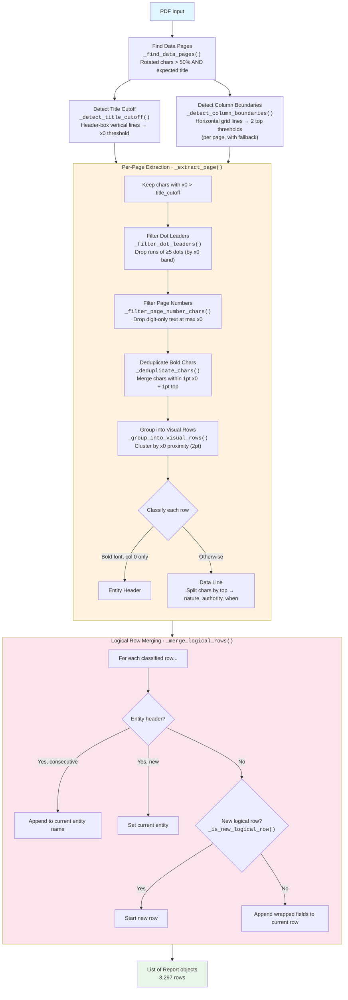
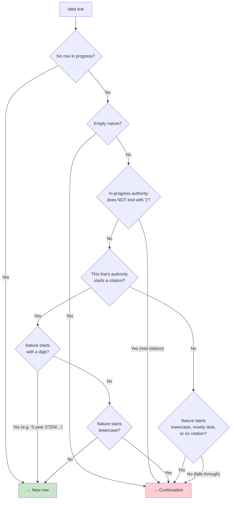

# Deterministic Structured Data Extraction from Government PDF Tables

## As-Built Design Notes

> This document describes the system as implemented in `extract.py`, which is
> the source of truth. An earlier version of this file was a pre-build design
> doc that diverged from the final implementation; this version reflects what
> was actually built and validated.

---

## 1. Problem Statement

We extract structured tabular data from *"List of Reports Which It Is the Duty
of Any Officer or Department to Make to Congress"* (House Document
CDOC-119hdoc4). The PDF has three properties that defeat conventional
extraction:

1. **The embedded text layer is correct but garbled by rendering artifacts.**
   The table pages are drawn through a 90°-rotated text matrix, so naive
   full-page text extraction produces reversed strings (`SSERGNOC` for
   `CONGRESS`). Bold is simulated by stamping each glyph twice at a ~0.4pt
   offset, producing doubled characters.

2. **OCR would only add noise.** The text layer *exists* and is correct — it's
   just laid out by a rotated transform. OCRing the raster would trade known,
   systematic distortions for unpredictable recognition errors.

3. **There is no machine-readable grid.** Ruled lines exist but don't form a
   complete grid; Tabula/Camelot detect no table. Column boundaries are implied
   by spatial position.

Target schema per row:

| Field | Example |
|---|---|
| `reporting_entity` | Government Accountability Office |
| `nature_of_report` | Review of Congressional Award Foundation audit |
| `authority` | 2 U.S.C. 807(b); Pub. L. 96-114, title I, Sec. 107 (as amended by Pub. L. 101-525, Sec. 8); (104 Stat. 2308) |
| `when_expected` | Not later than 180 days after the date on which the audit is received |

---

## 2. Design Principles

- **Fully deterministic.** The extraction pipeline uses no LLM and no
  randomness. Given the same PDF it always produces the same rows. (An LLM
  *cleanup* stage was considered in the original design but **not built** — it
  proved unnecessary. The only place an LLM appears is the offline validation
  harness in `judge.py`, which judges already-extracted rows against the source
  but never feeds back into extraction.)
- **Work at the character level, in PDF coordinates.** Because the text matrix
  is rotated, `pdfplumber`'s word grouping is unreliable. We operate on raw
  `page.chars` and reconstruct rows/columns ourselves from char positions.
- **Leverage the PDF's own structure.** Column boundaries and the title cutoff
  are derived from the document's ruled lines, not hard-coded coordinates, so
  the pipeline self-calibrates per page.

---

## 3. The rotated coordinate model

This is the key insight the whole pipeline rests on. The data pages are
rendered rotated 90°, so **PDF coordinates do not map to screen position the
way you'd expect**:

| PDF coordinate | Maps to (on the visually-upright page) |
|---|---|
| `x0` (increasing) | **row** position, top → bottom |
| `top` (decreasing) | **column** position, left → right (high `top` = left) |

Concretely:

- A **visual row** is a cluster of chars sharing one `x0` band. We group rows
  by `x0` proximity (`_group_into_visual_rows`, 2pt tolerance).
- **Reading order within a row** (left → right) is **decreasing `top`**, so
  text is assembled by sorting chars on `-top` (`_chars_to_text`).
- **Columns** are separated by `top` thresholds, not `x0`
  (`_assign_column`): highest `top` = column 0 (`nature_of_report`), then
  `authority`, then lowest `top` = column 2 (`when_expected`).

Keep this table in mind when reading the code — every "why is it sorting by
`x0` here but `top` there" question is answered by it.

---

## 4. Pipeline architecture

The orchestration lives in `extract()`. The diagram below reflects the actual
call structure:



---

## 5. Stage details

### 5.1 — Page selection · `_find_data_pages`

Iterates every page and keeps those where (a) more than 50% of chars are
rotated (`upright == False`) and (b) the page title matches
`"LIST OF REPORTS WHICH IT IS THE DUTY"` (`_has_expected_title`). The title
check is what excludes index/appendix sections that share the rotation but have
a different structure. Returns `(1-based page number, page)` tuples.

### 5.2 — Self-calibration · `_detect_title_cutoff`, `_detect_column_boundaries`

Both boundaries are derived from the PDF's ruled lines, not hard-coded:

- **Title cutoff** (`_detect_title_cutoff`): the header box is bounded by two
  long vertical lines (`_find_header_box_x_range`). Data chars are those with
  `x0` greater than the higher of the two — i.e. below the header box visually.
- **Column boundaries** (`_detect_column_boundaries`): the column grid is made
  of horizontal lines appearing at exactly two `top` values, each with multiple
  segments (≥3). Those two `top` values become the
  `nature|authority` and `authority|when` separators. Detection runs **per
  page** with the previous page's boundaries as a fallback, so a page whose
  grid lines are faint still gets sane values. A header-text-based fallback
  (`_detect_column_boundaries_from_headers`) covers the cold-start case.

### 5.3 — Char cleanup · `_filter_dot_leaders`, `_filter_page_number_chars`, `_deduplicate_chars`

Applied in order, on the data chars of each page:

1. **Dot leaders** — the `....` runs that connect `nature` to `authority` are
   removed by finding ≥5 consecutive dots within an `x0` band.
2. **Page numbers** — digit-only text at the maximum `x0` (the visual page
   bottom) is dropped before it leaks into the last row.
3. **Bold de-duplication** — the double-stamped bold artifact is removed
   **spatially**: two chars with the same text within 1pt of each other in both
   `x0` and `top` are collapsed to one. (This is more robust than
   string-pattern doubling detection because it never touches legitimately
   repeated letters like the `tt` in "Committee".)

### 5.4 — Row grouping & column assignment · `_extract_page`

After cleanup, chars are grouped into visual rows by `x0` proximity. Each row
is classified:

- **Entity header** (`_is_entity_header`) — the row is in a bold font *and* all
  its chars fall in column 0. These are the section headers like "Government
  Accountability Office".
- **Data line** — chars are bucketed into the three columns by `top`
  (`_assign_column`), and each cell's text is assembled by `_chars_to_text`
  (sort on `-top`) and normalized by `_clean_text` (strip dot remnants,
  collapse whitespace, drop a trailing lone dot).

### 5.5 — Logical row merging · `_merge_logical_rows`, `_is_new_logical_row`

A single report entry wraps across multiple physical lines, so consecutive
data lines must be merged. `_merge_logical_rows` walks the classified rows,
tracks the current entity (entity headers set or extend it), and for each data
line asks `_is_new_logical_row`: start a fresh row, or append this line's cells
to the row in progress?

The decision logic, in order:



The **mid-citation check** is load-bearing: a complete government citation
always closes with `)` after the `Stat.` reference (e.g. `(104 Stat. 2308)`).
If the row in progress ends mid-citation (e.g. `...Sec. 802(a) (as amended
by`), the next physical line *must* be its continuation — no matter how its own
nature/authority happen to start. Without this check, a single-word
continuation like `"Development"` (whose wrapped authority resumes with
`"Pub. L. ..."`) was wrongly split into its own row. See
`tests/test_extract.py::test_full_no_mid_citation_authorities`.

A citation "start" is recognized by `_CITATION_START`:

```python
_CITATION_START = re.compile(
    r"^\d+\s*U\.?S\.?C\.?"   # "2 U.S.C." / "12 U.S.C."
    r"|^Pub\.?\s*L\."        # "Pub. L."
    r"|^Added\s+by\s+Pub"    # "Added by Pub. L."
    r"|^Aug\.\s+\d"          # "Aug. 2, 1954" (historical statutes)
)
```

---

## 6. Output

`main.py` emits the merged rows in one of three formats — JSON Lines (default),
a JSON array, or CSV — each record being exactly the four schema fields. There
are no confidence scores or review flags; the deterministic output is taken as
canonical. The full document produces **3,297 rows**.

```jsonl
{"reporting_entity": "...", "nature_of_report": "...", "authority": "...", "when_expected": "..."}
```

---

## 7. Validation

Because the pipeline is deterministic, "is it correct?" is answered empirically,
not by confidence heuristics. Two layers:

1. **Unit + regression tests** (`tests/test_extract.py`, 21 tests) against a
   hand-verified 46-row fixture (`tests/test_doc.pdf`) plus structural
   invariants over the full PDF:
   - every `authority` closes with `)` (guards the mid-citation merge bug),
   - no single-word row with an empty `when_expected` (orphan-row guard),
   - every row has a non-empty nature and a citation-bearing authority,
   - no residual `..` dot-leader artifacts.

2. **LLM-as-judge audit** (`verify.py`, `verify_report.py`, `judge.py`): a
   seeded random sample of rows is rendered against its source page and judged
   by up to three independent vision models (Claude, Gemini, OpenAI). Every
   disagreement is adjudicated by hand against the PDF.

   A 300-row, 3-judge audit found **0 extraction errors** → **≥99% field-level
   accuracy at 95% confidence** (one-sided rule-of-three:
   `1 − 0.05^(1/300) ≈ 0.99%` upper bound on the error rate). Every judge
   "failure" was a false positive — most often a model "correcting" a typo that
   is present verbatim in the source (`"the the"`, `"Biannnually"`,
   `"recieved"`) or hallucinating a citation difference.

   Judge reliability for this citation-dense task: Claude Sonnet 4.5 and
   Gemini 2.5 Flash were dependable (~98–99%); gpt-4o-mini was not (88%, with
   incoherent reasoning) and should not be used as a judge here.

---

## 8. Dependencies

| Package | Purpose |
|---|---|
| `pdfplumber` | Char-level extraction with positions and font metadata |
| `pydantic` | The `Report` model (`schema.py`) |
| `pytest` | Test suite |
| `anthropic`, `google-genai`, `openai` | LLM-judge harness (`judge.py`) only |
| `pillow` | Page-image rendering for the QA report (`verify_report.py`) only |
| `python-dotenv` | Loads API keys from `.env` for `judge.py` |

Requires Python ≥ 3.13. `tabula-py` and `camelot` were evaluated and rejected
for this document class — both fail to detect the table (no machine-readable
grid, broken embedded fonts).
